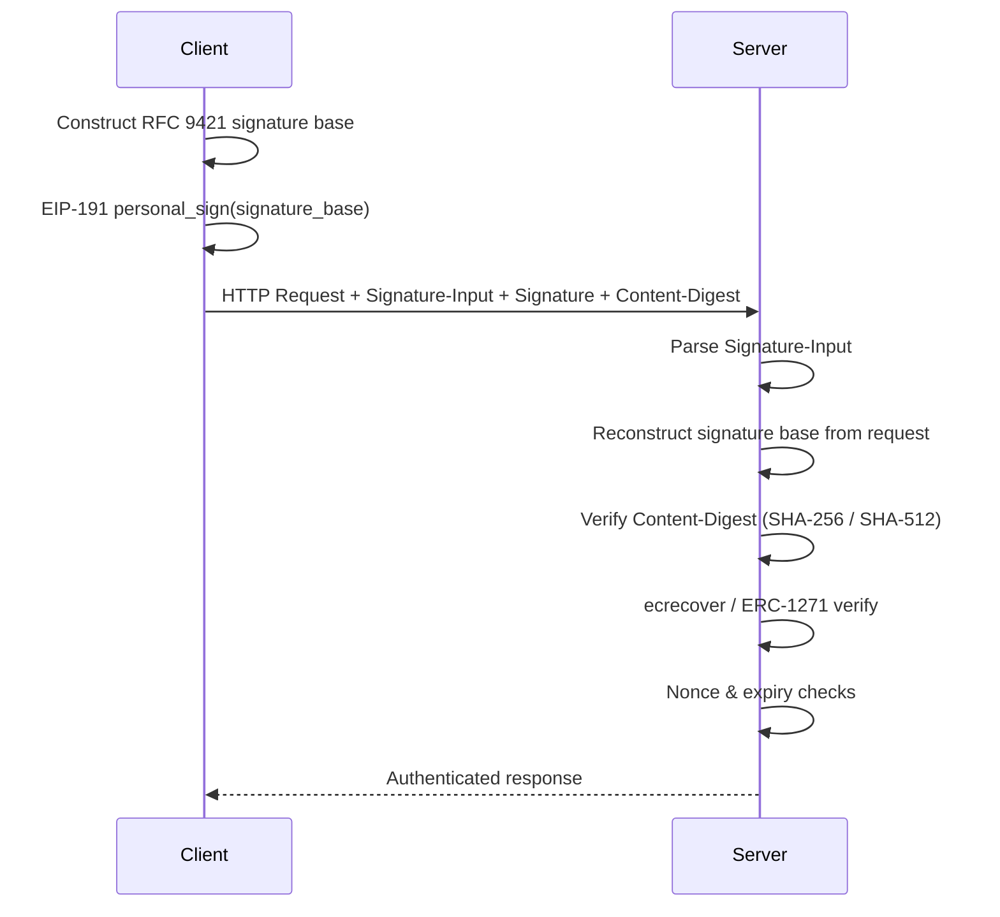

<!-- markdownlint-disable MD033 MD041 MD036 -->

<div align="center">

# ERC-8128

**Signed HTTP Requests with Ethereum**

[![CI][ci-badge]][ci-url]
[![crates.io][crate-badge]][crate-url]
[![docs.rs][doc-badge]][doc-url]
[![License][license-badge]][license-url]
[![Rust][rust-badge]][rust-url]

[ci-badge]: https://github.com/qntx/erc8128/actions/workflows/rust.yml/badge.svg
[ci-url]: https://github.com/qntx/erc8128/actions/workflows/rust.yml
[crate-badge]: https://img.shields.io/crates/v/erc8128.svg
[crate-url]: https://crates.io/crates/erc8128
[doc-badge]: https://img.shields.io/docsrs/erc8128.svg
[doc-url]: https://docs.rs/erc8128
[license-badge]: https://img.shields.io/badge/license-MIT%2FApache--2.0-blue.svg
[license-url]: LICENSE-MIT
[rust-badge]: https://img.shields.io/badge/rust-edition%202024-orange.svg
[rust-url]: https://doc.rust-lang.org/edition-guide/

Type-safe Rust SDK for [ERC-8128][spec]: HTTP request authentication via
[RFC 9421][rfc9421] message signatures with Ethereum accounts (EOA & ERC-1271).

[Quick Start](#quick-start) | [Features](#feature-flags) | [Protocol](#erc-8128-protocol) | [Examples](#examples) | [API Reference][doc-url]

</div>

## Quick Start

```toml
[dependencies]
erc8128 = { version = "0.3", features = ["k256"] }
```

### Sign & Verify (in-memory roundtrip)

```rust
use erc8128::{
    MemoryNonceStore, RejectReplayable, Request, SignOptions, VerifyPolicy,
    eoa::{EoaSigner, EoaVerifier},
    sign_request, verify_request,
};

let signer = EoaSigner::from_slice(&private_key_bytes, 1)?;

let request = Request {
    method: "POST",
    url: "https://api.example.com/orders",
    headers: &[("content-type", "application/json")],
    body: Some(b"{\"item\":\"widget\"}"),
};

// Sign
let signed = sign_request(&request, &signer, &SignOptions::default()).await?;

// Attach signature headers, then verify
let nonces = MemoryNonceStore::default();
let result = verify_request(
    &verify_req, &EoaVerifier, &nonces, &RejectReplayable, &VerifyPolicy::default(),
).await?;
println!("Authenticated: {} on chain {}", result.address, result.chain_id);
```

### reqwest Client

```toml
erc8128 = { version = "0.3", features = ["k256", "reqwest"] }
```

```rust
use erc8128::{SignOptions, client::signed_fetch, eoa::EoaSigner};

let signer = EoaSigner::from_slice(&key, 1)?;
let resp = signed_fetch(
    &reqwest::Client::new(),
    reqwest::Method::POST,
    "https://api.example.com/orders",
    &[("content-type", "application/json")],
    Some(b"{\"item\":\"widget\"}"),
    &signer,
    &SignOptions::default(),
).await?;
```

### axum Server

```toml
erc8128 = { version = "0.3", features = ["k256", "axum"] }
```

```rust
use axum::{Router, routing::post, Extension};
use erc8128::{
    MemoryNonceStore, RejectReplayable, VerifyPolicy, VerifySuccess,
    eoa::EoaVerifier, middleware::Erc8128Layer,
};

let app = Router::new()
    .route("/api", post(handler))
    .layer(Erc8128Layer::new(
        EoaVerifier,
        MemoryNonceStore::default(),
        RejectReplayable,
        VerifyPolicy::default(),
    ));

async fn handler(Extension(auth): Extension<VerifySuccess>) -> String {
    format!("Hello, {}!", auth.address)
}
```

## Feature Flags

| Feature | Dependencies | Provides |
| --- | --- | --- |
| `k256` | `k256` | `eoa::EoaSigner` + `eoa::EoaVerifier` — pure-Rust EOA signing & verification |
| `alloy` | `alloy-signer` | `alloy::AlloySigner<S>` — adapter for any `alloy_signer::Signer` |
| `axum` | `axum`, `tower` | `middleware::Erc8128Layer` — Tower middleware for automatic request verification |
| `reqwest` | `reqwest` | `client::signed_fetch` + `client::RequestBuilderExt` — signed HTTP requests |

The core crate (`sign_request`, `verify_request`, traits) has **zero** HTTP framework dependencies.

## Examples

```sh
cargo run --example roundtrip      --features k256             # in-memory sign → verify
cargo run --example reqwest_client --features k256,reqwest     # client-side signing
cargo run --example axum_server    --features k256,axum        # server-side middleware
cargo run --example e2e            --features k256,axum,reqwest # full end-to-end demo
```

The `e2e` example starts an axum server and a reqwest client in one process, demonstrating:

1. Fresh signature → 200 OK
2. Replay of the same signature → 401 (nonce already consumed)
3. New signature with fresh nonce → 200 OK

## ERC-8128 Protocol

### Signature Flow



### Binding Modes

| Mode | Covered Components | Semantics |
| --- | --- | --- |
| **Request-Bound** | `@method` `@authority` `@path` `@query` `content-digest` | Authorizes **exactly one** concrete HTTP request. |
| **Class-Bound** | Caller-defined set (must include `@authority`) | Authorizes **a class** of requests matching the covered components. |

### Replay Protection

| Mode | Nonce | Semantics |
| --- | --- | --- |
| **Non-Replayable** | Present | Each signature consumed **exactly once** via `NonceStore`. |
| **Replayable** | Absent | Valid within the `[created, expires]` window. Requires [`ReplayablePolicy`][doc-url] with early invalidation hooks (Section 5.2). |

### Signature Parameters (RFC 9421)

| Parameter | Required | Description |
| --- | --- | --- |
| `created` | Yes | Unix timestamp of signature creation. |
| `expires` | Yes | Unix timestamp of signature expiration (`> created`). |
| `keyid` | Yes | Signer identity: `erc8128:<chainId>:<address>`. |
| `nonce` | Non-Replayable | Cryptographically random replay-prevention token. |
| `tag` | No | Application-level discriminator for routing. |

### Content-Digest

Body integrity is protected via `Content-Digest` (SHA-256 or SHA-512). Four modes control signing behavior:

| Mode | Behavior |
| --- | --- |
| **`Auto`** | Use an existing header, or compute one from the body. *(default)* |
| **`Recompute`** | Always recompute, overwriting any existing header. |
| **`Require`** | Fail if the header is absent — never compute. |
| **`Off`** | Disable entirely — fail if body-bound components are present. |

## Extensibility

The SDK delegates all environment-specific logic to pluggable traits:

| Trait | Responsibility | Built-in |
| --- | --- | --- |
| [`Signer`][doc-url] | Produce EIP-191 `personal_sign` signatures. | `EoaSigner` (k256), `AlloySigner` (alloy) |
| [`Verifier`][doc-url] | Verify signatures: `(address, message, signature)`. | `EoaVerifier` (ecrecover) |
| [`NonceStore`][doc-url] | Atomically consume nonces for replay protection. | `MemoryNonceStore`, `NoNonceStore` |
| [`ReplayablePolicy`][doc-url] | Early invalidation hooks for replayable signatures (Section 5.2). | `RejectReplayable` |

## Related Standards

| Standard | Relationship |
| --- | --- |
| [RFC 9421][rfc9421] | HTTP Message Signatures — the wire format ERC-8128 builds on |
| [EIP-191][eip191] | Signed Data Standard — `personal_sign` message prefix |
| [ERC-1271][erc1271] | Standard Signature Validation for smart contract accounts |
| [ERC-6492][erc6492] | Signature Validation for pre-deployed (counterfactual) contracts |

## License

Licensed under either of:

- Apache License, Version 2.0 ([LICENSE-APACHE](LICENSE-APACHE) or <https://www.apache.org/licenses/LICENSE-2.0>)
- MIT License ([LICENSE-MIT](LICENSE-MIT) or <https://opensource.org/licenses/MIT>)

at your option.

Unless you explicitly state otherwise, any contribution intentionally submitted for inclusion in this project shall be dual-licensed as above, without any additional terms or conditions.

---

<div align="center">

A **[QNTX](https://qntx.fun)** open-source project.

<a href="https://qntx.fun"></a>

<!--prettier-ignore-->
Code is law. We write both.

</div>

[spec]: https://erc8128.org
[rfc9421]: https://www.rfc-editor.org/rfc/rfc9421
[eip191]: https://eips.ethereum.org/EIPS/eip-191
[erc1271]: https://eips.ethereum.org/EIPS/eip-1271
[erc6492]: https://eips.ethereum.org/EIPS/eip-6492
